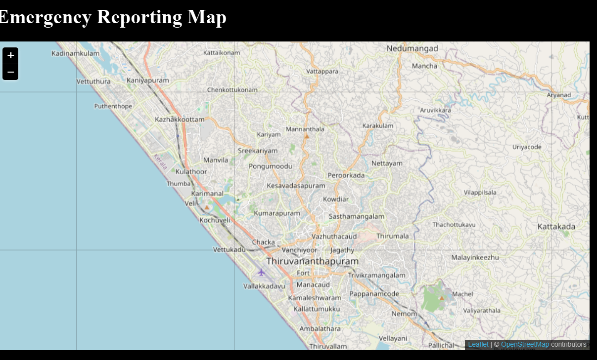
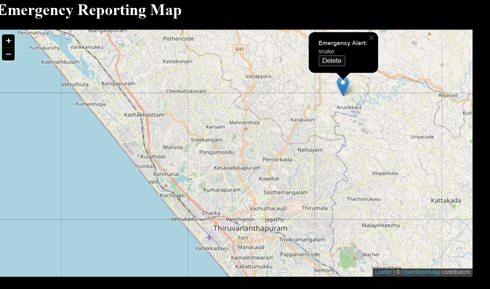
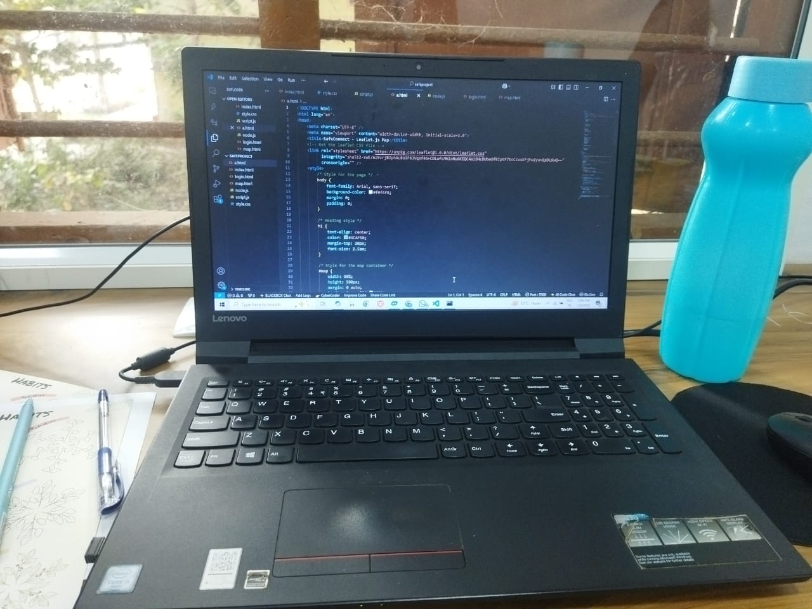
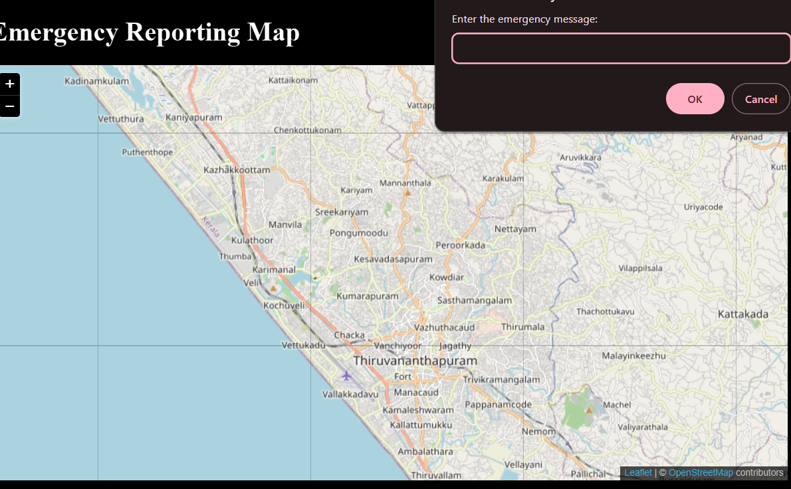

# TinkHerHack
Tinker Her Hack Project By Tech Girlies
[SafeConnect] 🎯
Basic Details
Team Name: [Tech Girlies]
Team Members
Member 1: Sania K S - GEC Kozhikode
Member 2: Ameya Arul - GEC Kozhikode
Member 3: Anjana Unnikrishnan - GEC Kozhikode

Hosted Project Link
[mention your project hosted project link here]

Project Description
This project is a Leaflet-based Emergency Reporting System that allows users to mark emergency locations on an interactive map. The backend, built with Flask and SQLite, stores and retrieves emergency reports, enabling real-time updates and management of alerts.

The Problem statement
Emergencies require fast action, but authorities are often slow to respond due to delayed reports and lack of real-time data. Our project provides a quick and efficient way for people to mark emergencies on a shared, live map, ensuring faster awareness and response by the community and emergency services.

The Solution
Why wait for slow-moving authorities when emergencies demand instant action? Our platform puts emergency reporting in the hands of the people! With a simple tap, users can mark incidents on a live map, ensuring faster awareness and response from both the community and first responders. No more delays—just real-time alerts, instant visibility, and a safer world!

Technical Details
Technologies/Components Used
For Software:

Languages: Python, JavaScript, HTML & CSS 
Framework: Flask
Libraries: Flask-CORS ,SQLite3, Leaflet.js 
Tools :GitHub/Git --- (For hosting the backend), VS Code

Implementation
For Software:

Installation
pip install flask flask-cors
python -c "from app import init_db; init_db()"

Run
python app.py

Project Documentation
For Software:

Screenshots (Add at least 3)
 Opening page to select the location of the emergency

 Add a small description of the emergency

 Choose a marked point to view what the emegency is and to delete if it is resolved

Build Photos

 Create code for the front and backend

 Final Product

Project Demo
Video
[demo.mp4] SafeConnect is a real-time emergency reporting system that allows users to mark incidents on an interactive map. Users can select a location, add a brief description of the emergency, and view or delete reports once resolved

Team Contributions
[Ameya Arul]: Backend
[Saniya K S]: Frontend
[Anjana Unnikrishnan]: Documentation and Presentation creation

